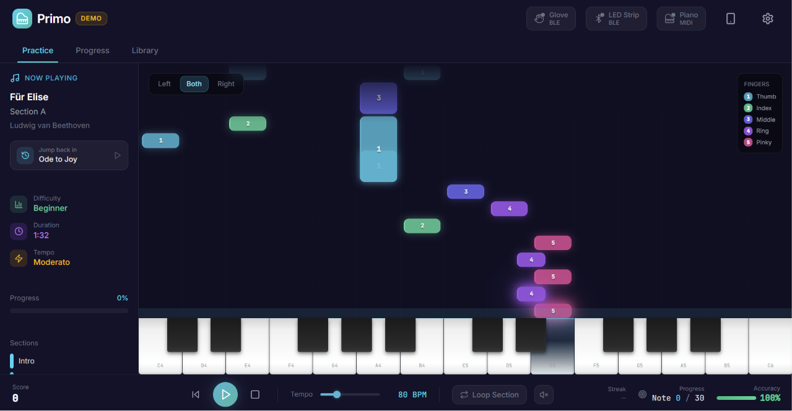
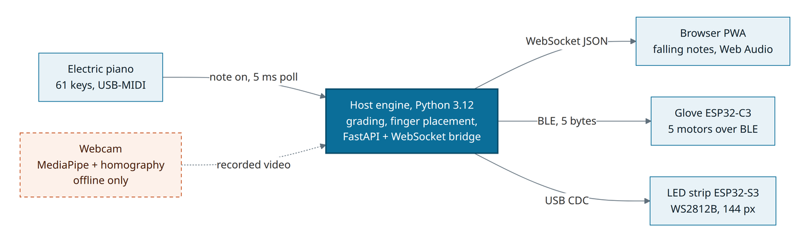
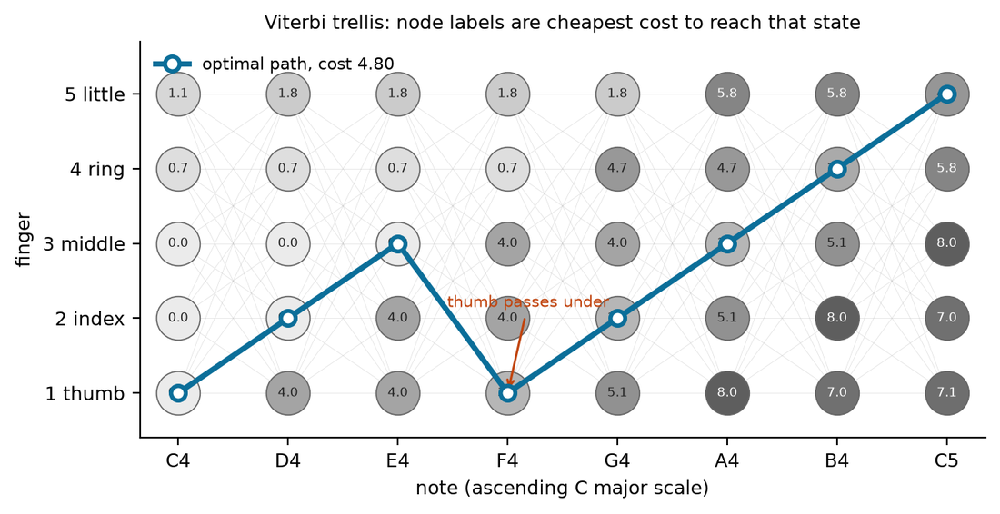
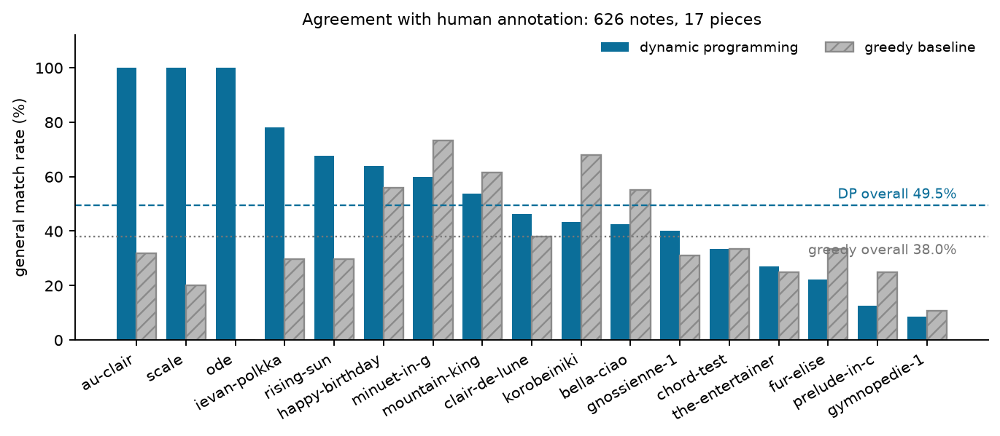
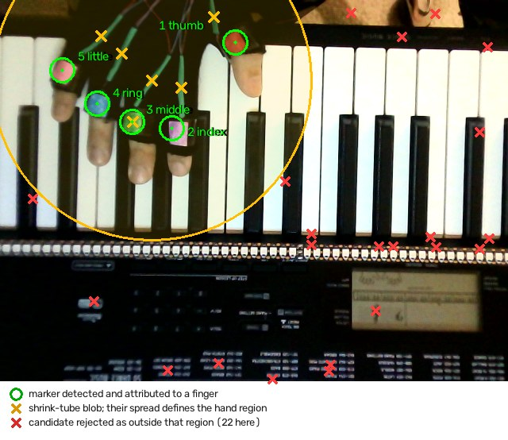
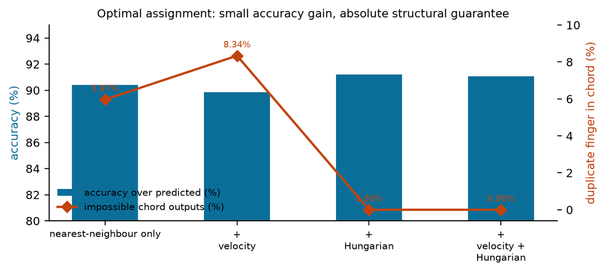
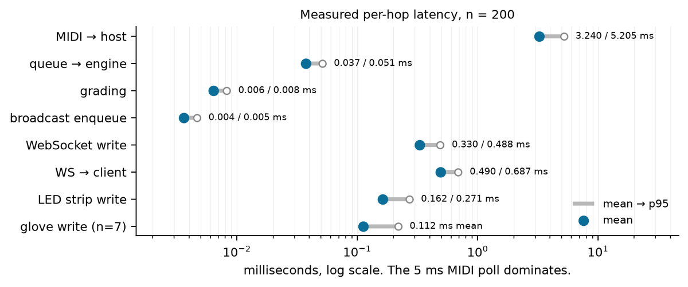
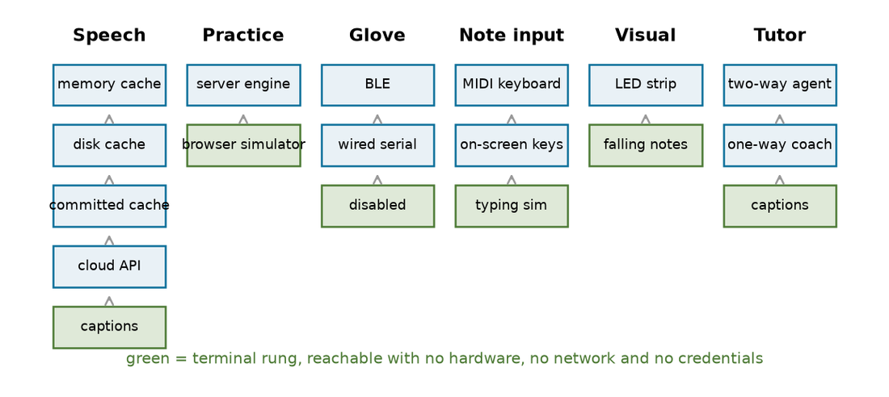
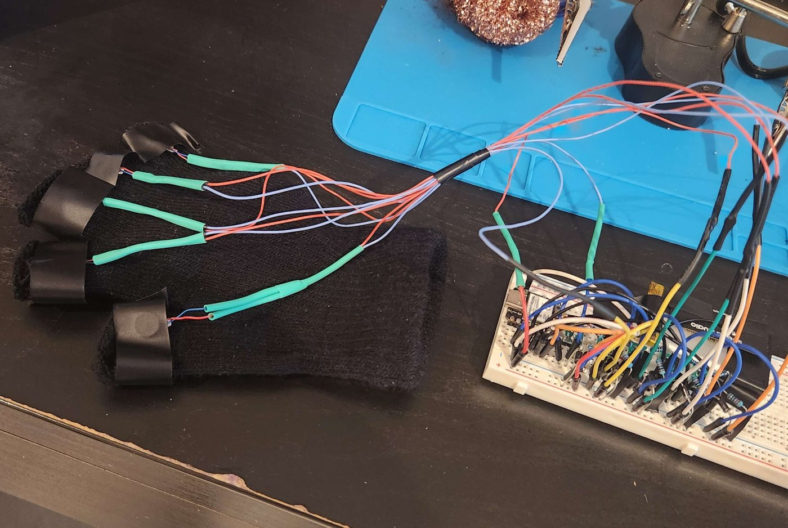
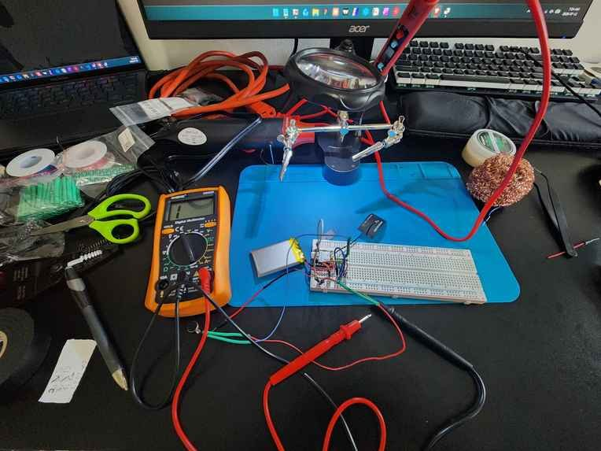

# Primo

#### 🏆 Best Hardware Hack award | A piano glove and tutor that teaches you how to play

Falling notes on screen, LEDs above the keys, and a vibration on the finger
that should play the next note. Everything except the voice runs on your own
machine.

[**Live app**](https://pianolearn-63zeg.ondigitalocean.app/) &nbsp;·&nbsp;
[**Demo video**](https://youtu.be/YrutIHwnlg4) &nbsp;·&nbsp;
[How it works](#how-it-works) &nbsp;·&nbsp;
[What I built](#what-i-built)

 

 

## The problem

Beginner sheet music tells you which note to play and when. It almost never
tells you **which finger** to use, and that is the decision that decides
whether a passage is playable at tempo. Pick badly and you run out of fingers
halfway through a run, or your thumb ends up on a black key. Practise it
badly a hundred times and it becomes a habit you have to unlearn.

Primo makes that decision for you, then feeds it back through three channels
at once while you play:

| Channel | Hardware | What it tells you |
|---|---|---|
| **Screen** | any browser | which note is coming, with the finger number on it |
| **Light** | WS2812B strip above the keys | which key, in the right place on the keyboard |
| **Touch** | 5 vibration motors on a glove | which finger, without looking away from your hands |

You can run it with none of that hardware. The browser alone is a complete
practice app, and the number row of your keyboard becomes a playable piano.

 

## How it works

The Python engine is the only thing that touches hardware. The browser is a
pure WebSocket view, so the same build runs as a local app, as an installable
PWA, or as the public demo with no hardware attached at all.

 

## Choosing the finger placement

Every note has five candidate fingers, so a 100 note piece has 5^100 possible
finger placements. Scoring them one at a time is hopeless, but the cost of a
choice only depends on the **previous** finger, which makes it a shortest-path
problem over a trellis. A dynamic program (Viterbi) finds the exact optimum in
time linear in the number of notes.

One octave of C major. The cheapest path puts the thumb under at F4, which
is what a teacher would tell you to do. Node labels are the cheapest cost to
reach that state.

The cost function follows the shape of Parncutt's ergonomic model: hand span
limits per finger pair, a penalty for the weak ring and little fingers, thumb
on a black key, thumb passes, awkward leaps, and hand relocation. The weights
are mine, tuned by hand against annotated pieces.

**Results**, against 626 hand-annotated notes across 17 pieces, measured with
the general match rate from Nakamura et al. (2020):

| | Match rate | Total model cost |
|---|---:|---:|
| **Dynamic programming** | **49.5%** | **326.1** |
| Greedy baseline | 38.0% | 673.5 |
| Human annotator | (reference) | 833.0 |

Two things worth reading off that table. The solver finds a **cheaper path
than the human annotator did** on the model's own cost function, so most
disagreements are places where more than one finger placement is defensible,
not places where it is wrong. And 49.5% sounds low until you know the field:
published systems on the standard PIG benchmark land around 61 to 65%, and two
human annotators only agree with each other about 71% of the time.

It solves a full piece in **1.5 ms** on average, or about 40 microseconds per
note, so the finger placement for a whole song is settled before the first
note falls.

 

## Checking the finger placement with a camera

The glove can tell you which finger to use. It cannot tell whether you
listened, because it has motors and no sensors. So there is a second,
experimental pipeline that watches your hands with an ordinary webcam.

The coloured-marker variant, tried on real hardware. Green circles are
markers attributed to a finger, orange crosses define the hand region, red
crosses are candidates rejected as outside it.

The chain is: MediaPipe Hands gives 21 landmarks per frame, a planar
**homography** maps the camera image onto the physical keybed in millimetres,
and the **Hungarian algorithm** assigns fingertips to the keys that MIDI says
were pressed. The homography is hand-implemented (direct linear transform with
Hartley normalisation) rather than pulled from OpenCV, because the
conditioning behaviour is the interesting part.

Optimal assignment buys about one accuracy point over nearest-neighbour
matching. What it actually buys is a **guarantee**: nearest-neighbour hands
back the same finger twice in a chord 6 to 8% of the time, which is an
anatomically impossible answer. The Hungarian step drives that to exactly
zero, by construction.

> **Honest scope.** Those accuracy numbers are measured on **synthetic**
> frames with known ground truth. They validate the geometry and the
> assignment logic, not real-world accuracy with a real hand. The pipeline
> wires into the live practice loop behind `--verify-fingering`, and the
> mechanism works end to end, but nobody has measured how well it attributes
> fingers on real video. It is an experiment, and it is labelled as one.

 

## Latency

Wessel and Wright (2002) put the threshold for feedback that feels attached to
your own action at about 10 ms. So the budget is not a guess, it is measured,
by a harness that stamps every hop over 200 real note events.

| Path | Mean | p95 |
|---|---:|---:|
| **MIDI note to browser frame, end to end** | **3.78 ms** | **5.80 ms** |
| MIDI wire to host | 3.24 ms | 5.20 ms |
| Grading decision | 0.006 ms | 0.008 ms |
| WebSocket write | 0.330 ms | 0.488 ms |
| LED strip write | 0.162 ms | 0.271 ms |
| Glove write (n=7) | 0.112 ms | 0.218 ms |

The whole application is a rounding error next to the 5 ms MIDI poll that
dominates it. Caveats stay attached to the number: the origin stamp is an ALSA
loopback port, not the keyboard's own key-sense, and the client hop is
loopback TCP with no browser paint.

 

## Everything has a fallback

No missing device, missing key or missing network stops a practice session.
Six subsystems each degrade down their own ladder, and every ladder ends
somewhere reachable with no hardware, no network and no credentials.

The nicest one is the voice. The coach's phrase space is finite and
enumerable, so a build step pre-renders every line it can ever say into a
committed cache. After that the coach speaks in the real cloud voice
**completely offline**, with no API key and no network.

 

## The hardware

Hand-built, output only. Five coin motors sit in heat-shrink sleeves on the
fingers, wired back to a Seeed XIAO ESP32-C3 on the back of the hand.

Where it got made. The XIAO and its LiPo on the breadboard, helping hands
and a magnifier for the motor leads, and a multimeter never far away.

| Part | Spec | Job |
|---|---|---|
| Glove MCU | Seeed XIAO ESP32-C3, 21 x 18 mm | BLE GATT server, 5 PWM channels |
| Motors | 5 x coin vibration, 3 V, 70 to 100 mA | one per finger |
| Drivers | AO3400 N-channel MOSFETs, 1N5817 flyback | switch the motors off a GPIO |
| Battery | 3.7 V LiPo, 1000 mAh with protection | about 3 hours of practice |
| Piano MCU | ESP32-S3 N16R8, native USB CDC | LED strip protocol over USB |
| LED strip | WS2812B, 144 px/m, 1 m | about 2 LEDs per white key |
| Keyboard | any 61-key with USB-MIDI out | note input |

Two safety details in the glove firmware that are easy to skip and expensive
to skip. Motor duty is capped at 180/255, so a freshly charged 4.2 V cell
never delivers more than about 3.0 V average to a 3 V motor. And a 500 ms
dead-man watchdog kills every channel if the host stops talking, so a crashed
laptop cannot leave a motor buzzing against someone's finger.

 

## What I built

About 25,800 lines across the stack, all written for this project. The source
lives in a private repository, so this page is the tour. Happy to walk anyone
through the code.

| Part | Size | What it does |
|---|---|---|
| **Finger placement solver** | 1,450 lines Python | cost model, exact DP solver, greedy baseline, evaluation against 626 annotated notes |
| **Camera pipeline** | 6,334 lines Python | MediaPipe wrapper, planar homography, Hungarian assignment, synthetic evaluation, marker experiment |
| **Practice engine** | 6,559 lines Python, 17 modules | grading, MIDI input, BLE glove link, LED serial link, WebSocket bridge, voice coach, tutor, terminal UI |
| **Web app** | 8,564 lines TypeScript | React PWA, falling-note view, Web Audio synthesis, 14 songs |
| **Glove firmware** | 233 lines C++ | BLE GATT service, 5 PWM channels, duty cap, dead-man watchdog |
| **LED firmware** | 364 lines C++ | WS2812B protocol over USB CDC |
| **Tooling** | 2,269 lines Python | latency harness, LED soak test, song importer, voice cache generator |
| **Tests** | 424 across 19 files | all passing |

 

## Built with

| Layer | Stack |
|---|---|
| **Engine** | Python 3.12, FastAPI, uvicorn, websockets, mido, python-rtmidi, bleak, pyserial, numpy, scipy, OpenCV, MediaPipe Tasks |
| **Frontend** | React 18, Vite, Tailwind, react-router, motion, lucide-react, Web Audio |
| **Firmware** | Arduino-ESP32 2.0.17 via PlatformIO, Bluedroid BLE, FastLED |
| **Voice** | ElevenLabs Flash v2.5 and ElevenLabs Agents, both optional |
| **Deploy** | Docker, DigitalOcean App Platform, Bubblewrap TWA shell for Android |

Off the shelf and used as-is: Google's pretrained MediaPipe Hands model, SciPy's
`linear_sum_assignment`, and the shape of Parncutt's cost model. The weights,
the solver, the homography, the assignment layer, the firmware and the engine
are the work here.

 

## References

- Parncutt, R., Sloboda, J.A., Clarke, E.F., Raekallio, M., Desain, P. (1997)
  An Ergonomic Model of Keyboard Fingering for Melodic Fragments.
  *Music Perception* 14(4), 341-382.
- Nakamura, E., Saito, Y., Yoshii, K. (2020) Statistical Learning and
  Estimation of Piano Fingering. *Information Sciences* 517, 68-85.
- Zhang, F. et al. (2020) MediaPipe Hands: On-device Real-time Hand Tracking.
  *CVPR Workshop on Computer Vision for AR/VR*, arXiv:2006.10214.
- Wessel, D., Wright, M. (2002) Problems and Prospects for Intimate Musical
  Control of Computers. *Computer Music Journal* 26(3), 11-22.
- Takegawa, Y., Terada, T., Nishio, S. (2006) Design and Implementation of a
  Real-Time Fingering Detection System for Piano Performance. *ICMC*, 67-74.

 
Built by <a href="https://github.com/JowiAoun">Jowi Aoun</a>
  
Text and images &copy; 2026 Jowi Aoun, licensed
<a href="https://creativecommons.org/licenses/by-nc-nd/4.0/">CC BY-NC-ND 4.0</a>.
Source code not included.

